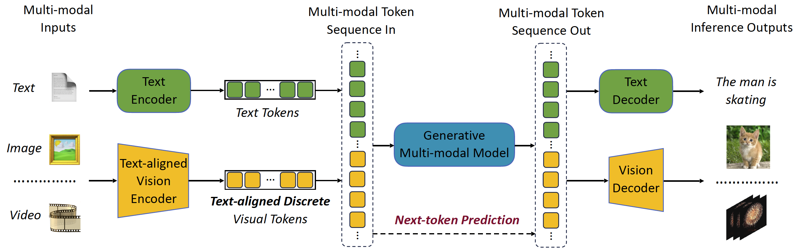
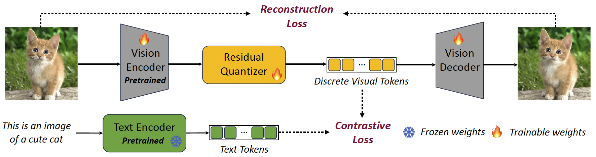

# VILA-U: a Unified Foundation Model Integrating Visual Understanding and Generation

\[[Online Demo](https://vila-u.hanlab.ai)\] \[[Paper](https://arxiv.org/abs/2409.04429#)\] \[[Project](https://hanlab.mit.edu/projects/vila-u)\] \[[Models](https://huggingface.co/collections/mit-han-lab/vila-u-7b-6716f7dd5331e4bdf944ffa6)\]


<p align="left">
    
</p>

<p align="center">
<b> Figure 1: Multi-token in, Multi-token out Training and Inference. </b>
</p>

<p align="left">
    
</p>

<p align="center">
<b> Figure 2: Unified Foundation Vision Tower. </b>
</p>


## News

- \[2025/01\] 🎉 VILA-U has been accepted to ICLR2025!
- \[2024/10\] Online demo of VILA-U is available: [https://vila-u.hanlab.ai](https://vila-u.hanlab.ai). Have a try!
- \[2024/10\] We release the code and [models](https://huggingface.co/collections/mit-han-lab/vila-u-7b-6716f7dd5331e4bdf944ffa6) for VILA-U!

## Abstract

**VILA-U** is a **U**nified foundation model that integrates **V**ideo, **I**mage, **La**nguage understanding and generation. Traditional visual language models (VLMs) use separate modules for understanding and generating visual content, which can lead to misalignment and increased complexity. In contrast, VILA-U employs a single autoregressive next-token prediction framework for both tasks, eliminating the need for additional components like diffusion models. This approach not only simplifies the model but also achieves near state-of-the-art performance in visual language understanding and generation. The success of VILA-U is attributed to two main factors: the unified vision tower that aligns discrete visual tokens with textual inputs during pretraining, which enhances visual perception, and autoregressive image generation can achieve similar quality as diffusion models with high-quality dataset. This allows VILA-U to perform comparably to more complex models using a fully token-based autoregressive framework.

## Preparation

### Environment Setup

```bash
git clone https://github.com/mit-han-lab/vila-u
cd vila-u
./environment_setup.sh vila-u
```

### Download Models

Please download our [models](https://huggingface.co/collections/mit-han-lab/vila-u-7b-6716f7dd5331e4bdf944ffa6) from HuggingFace.

```bash
git lfs install
git clone https://huggingface.co/mit-han-lab/vila-u-7b-256
```

## Usage

### Gradio Demo

Run the following command to launch a local gradio demo:
```bash
CUDA_VISIBLE_DEVICES=0 python app.py --model_path path/to/your_downloaded_model
```

### Command Line Inference

```bash
# Image Understanding
CUDA_VISIBLE_DEVICES=0 python inference.py --model_path path/to/your_downloaded_model --image_path assets/example_image1.jpg --query "Can you describe what is happening?"
```

```bash
# Video Understanding
CUDA_VISIBLE_DEVICES=0 python inference.py --model_path path/to/your_downloaded_model --video_path assets/example_video1.mp4 --query "Elaborate on the visual and narrative elements of the video in detail."
```

```bash
# Image Generation
CUDA_VISIBLE_DEVICES=0 python inference.py --model_path path/to/your_downloaded_model --prompt "A snowy mountain." --save_path path/to/save_images --generation_nums 8
```

```bash
# Video Generation
CUDA_VISIBLE_DEVICES=0 python inference.py --model_path path/to/your_downloaded_model --prompt "Fireworks in the air." --video_generation True --save_path path/to/save_videos
```

### Evaluation

Evaluate VILA-U on visual language benchmarks with the following command:
```bash
vila_u-eval -m path/to/model -c vicuna_v1 -ti local
```
Please refer to `vila_u/cli/eval.py` for more argument details.

### Training

Note: Please prepare data before training. Data preparation details are in the file `vila_u/data/datasets_mixture.py`.

```bash
# Pretrain
srun -p your_slurm_partition -N 8 -t 04:00:00 -A your_slurm_account -J vila-u:pretrain --gpus-per-node 8 --exclusive --dependency singleton bash scripts/train/pretrain.sh &
```

```bash
# SFT
srun -p your_slurm_partition -N 8 -t 04:00:00 -A your_slurm_account -J vila-u:sft --gpus-per-node 8 --exclusive --dependency singleton bash scripts/train/sft.sh &
```

## Acknowledgment

We thank Zhijian Liu from NVIDIA for his assistance with the evaluation setup.

## Citation

If you find VILA-U useful or relevant to your project and research, please kindly cite our paper:

```bibtex
@article{wu2024vila,
  title={Vila-u: a unified foundation model integrating visual understanding and generation},
  author={Wu, Yecheng and Zhang, Zhuoyang and Chen, Junyu and Tang, Haotian and Li, Dacheng and Fang, Yunhao and Zhu, Ligeng and Xie, Enze and Yin, Hongxu and Yi, Li and others},
  journal={arXiv preprint arXiv:2409.04429},
  year={2024}
}
```

